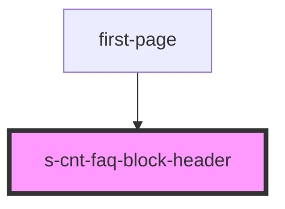

# s-cnt-faq-block-header

<!-- Auto Generated Below -->

## Properties

| Property      | Attribute | Description                            | Type                | Default |
| ------------- | --------- | -------------------------------------- | ------------------- | ------- |
| `blockHeader` | --        | Получение данных из массива для вывода | `SFaqBlockHeader[]` | `[]`    |

## Events

| Event        | Description                       | Type               |
| ------------ | --------------------------------- | ------------------ |
| `clickLeft`  | Клик по кнопке на страницу вперед | `CustomEvent<any>` |
| `clickLink`  | Клик по ссылке                    | `CustomEvent<any>` |
| `clickRight` | Клик по кнопке на страницу назад  | `CustomEvent<any>` |

## Dependencies

### Used by

 - [first-page](../first-page)

### Graph

----------------------------------------------

*Built with [StencilJS](https://stenciljs.com/)*
