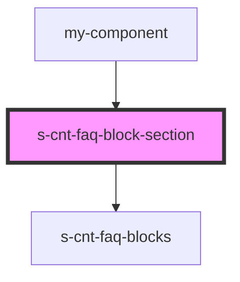

# s-cnt-faq-block-section

<!-- Auto Generated Below -->

## Properties

| Property       | Attribute | Description | Type                 | Default |
| -------------- | --------- | ----------- | -------------------- | ------- |
| `blockSection` | --        |             | `SFaqBlockSection[]` | `[]`    |

## Events

| Event        | Description | Type               |
| ------------ | ----------- | ------------------ |
| `clickLeft`  |             | `CustomEvent<any>` |
| `clickLink`  |             | `CustomEvent<any>` |
| `clickRight` |             | `CustomEvent<any>` |

## Dependencies

### Used by

 - [my-component](../my-component)

### Depends on

- [s-cnt-faq-blocks](./res/view/s-cnt-faq-blocks)

### Graph

----------------------------------------------

*Built with [StencilJS](https://stenciljs.com/)*
