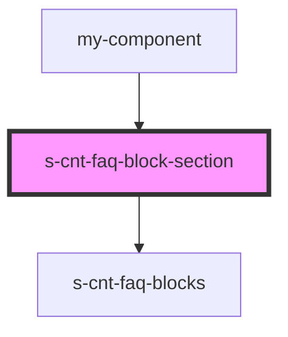

# s-cnt-faq-block-section

<!-- Auto Generated Below -->

## Properties

| Property       | Attribute | Description                            | Type                 | Default |
| -------------- | --------- | -------------------------------------- | -------------------- | ------- |
| `blockSection` | --        | Получение данных из массива для вывода | `SFaqBlockSection[]` | `[]`    |

## Events

| Event              | Description                              | Type               |
| ------------------ | ---------------------------------------- | ------------------ |
| `clickBlockAuthor` | Клик по блоку автора компонента 'blocks' | `CustomEvent<any>` |
| `clickBlockHeader` | Клик по Заголовку компонента 'blocks'    | `CustomEvent<any>` |
| `clickBlockImg`    | Клик по картинке компонента 'blocks'     | `CustomEvent<any>` |
| `clickBlockText`   | Клик по тексту компонента 'blocks'       | `CustomEvent<any>` |
| `clickLeft`        | Клик по кнопке на страницу вперед        | `CustomEvent<any>` |
| `clickLink`        | Клик по ссылке                           | `CustomEvent<any>` |
| `clickRight`       | Клик по кнопке на страницу назад         | `CustomEvent<any>` |

## Dependencies

### Used by

 - [my-component](../my-component)

### Depends on

- [s-cnt-faq-blocks](./res/view/s-cnt-faq-blocks)

### Graph

----------------------------------------------

*Built with [StencilJS](https://stenciljs.com/)*
