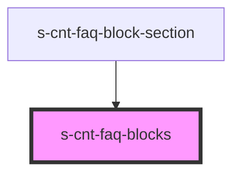

# s-cnt-faq-blocks

<!-- Auto Generated Below -->

## Properties

| Property | Attribute | Description | Type           | Default |
| -------- | --------- | ----------- | -------------- | ------- |
| `blocks` | --        |             | `SFaqBlocks[]` | `[]`    |

## Events

| Event              | Description | Type               |
| ------------------ | ----------- | ------------------ |
| `clickBlockAuthor` |             | `CustomEvent<any>` |
| `clickBlockHeader` |             | `CustomEvent<any>` |
| `clickBlockImg`    |             | `CustomEvent<any>` |
| `clickBlockText`   |             | `CustomEvent<any>` |

## Dependencies

### Used by

 - [s-cnt-faq-block-section](../../..)

### Graph

----------------------------------------------

*Built with [StencilJS](https://stenciljs.com/)*
