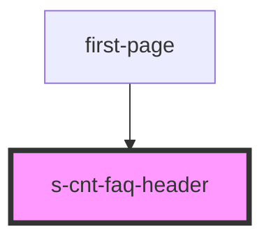

# s-cnt-faq-header

<!-- Auto Generated Below -->

## Properties

| Property | Attribute | Description | Type           | Default |
| -------- | --------- | ----------- | -------------- | ------- |
| `header` | --        |             | `SFaqHeader[]` | `[]`    |

## Events

| Event       | Description          | Type               |
| ----------- | -------------------- | ------------------ |
| `clickBack` | Клик по кнопке назад | `CustomEvent<any>` |

## Dependencies

### Used by

 - [first-page](../first-page)

### Graph

----------------------------------------------

*Built with [StencilJS](https://stenciljs.com/)*
