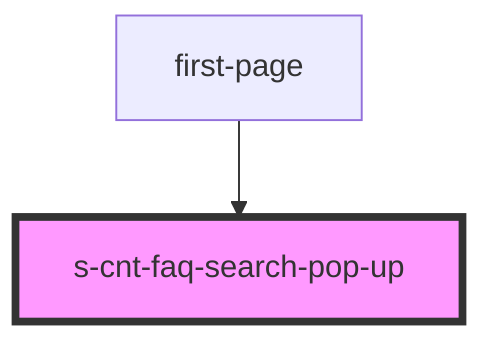

# s-cnt-faq-search-pop-up

<!-- Auto Generated Below -->

## Properties

| Property          | Attribute | Description             | Type                       | Default |
| ----------------- | --------- | ----------------------- | -------------------------- | ------- |
| `searchHintsData` | --        | Прием данных из массива | `SCntFaqSearchHintElem[]`  | `[]`    |
| `searchPlace`     | --        | Содержимое placeholder  | `SCntFaqSearchPlaceElem[]` | `[]`    |

## Events

| Event             | Description                      | Type               |
| ----------------- | -------------------------------- | ------------------ |
| `clickBlackBlock` | Клик по черному блоку            | `CustomEvent<any>` |
| `clickHints`      | Клик по подсказкам поисковика    | `CustomEvent<any>` |
| `clickSearchPop`  | Клик по кнопке поиск             | `CustomEvent<any>` |
| `searchKeyDown`   |                                  | `CustomEvent<any>` |
| `searchKeyUp`     | Содержимое поля ввода поисковика | `CustomEvent<any>` |

## Dependencies

### Used by

 - [first-page](../first-page)

### Graph

----------------------------------------------

*Built with [StencilJS](https://stenciljs.com/)*
