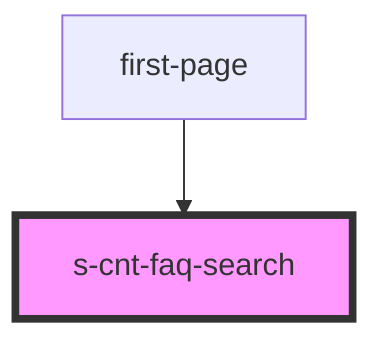

# s-cnt-faq-search

<!-- Auto Generated Below -->

## Properties

| Property   | Attribute | Description                           | Type                   | Default |
| ---------- | --------- | ------------------------------------- | ---------------------- | ------- |
| `category` | --        | Прием данных о категориях  из массива | `SFaqSearchElements[]` | `[]`    |
| `logo`     | --        | Прием данных логотипе  из массива     | `SFaqLogoElements[]`   | `[]`    |
| `menu`     | --        | Прием данных menu  из массива         | `SFaqSearchElements[]` | `[]`    |

## Events

| Event           | Description           | Type               |
| --------------- | --------------------- | ------------------ |
| `clickCategory` | Клик по категориям    | `CustomEvent<any>` |
| `clickLogo`     | Клик по Логотипу      | `CustomEvent<any>` |
| `clickMenu`     | Клик по  ссылкам меню | `CustomEvent<any>` |
| `clickSearch`   | Клик по кнопке поиска | `CustomEvent<any>` |

## Dependencies

### Used by

 - [first-page](../first-page)

### Graph

----------------------------------------------

*Built with [StencilJS](https://stenciljs.com/)*
