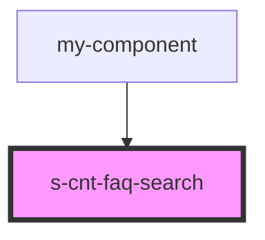

# s-cnt-faq-search

<!-- Auto Generated Below -->

## Properties

| Property | Attribute | Description             | Type             | Default |
| -------- | --------- | ----------------------- | ---------------- | ------- |
| `header` | --        | Прием данных из массива | `SFaqElements[]` | `[]`    |

## Events

| Event           | Description           | Type               |
| --------------- | --------------------- | ------------------ |
| `clickBack`     | Клик по кнопке назад  | `CustomEvent<any>` |
| `clickCategory` | Клик по категориям    | `CustomEvent<any>` |
| `clickLogo`     | Клик по Логотипу      | `CustomEvent<any>` |
| `clickMenu`     | Клик по  ссылкам меню | `CustomEvent<any>` |
| `clickSearch`   | Клик по кнопке поиска | `CustomEvent<any>` |

## Dependencies

### Used by

 - [my-component](../my-component)

### Graph

----------------------------------------------

*Built with [StencilJS](https://stenciljs.com/)*
